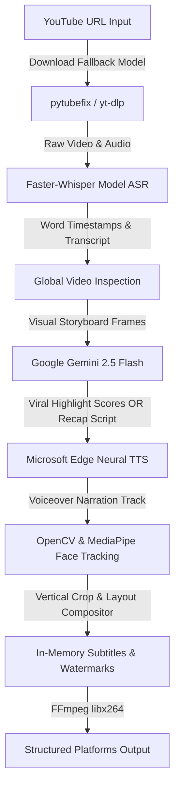

# 🎬 AI Video Clipper & Movie Recap Engine

An optimized, professional-grade local Python automation engine designed to download, transcribe, analyze, crop, narrate, and caption long-form videos into high-engagement, vertical short-form clips (9:16) for TikTok, YouTube Shorts, and Instagram Reels. 

The software leverages cutting-edge Multimodal AI models, Speech-to-Text (ASR) networks, Neural Text-to-Speech synthesis, and real-time Computer Vision.

---

## 🔗 Chained AI Pipeline Architecture

The engine coordinates multiple state-of-the-art AI systems into a single, seamless pipeline:



1. **Hearing (ASR):** `Faster-Whisper` transcribes audio streams down to millisecond-level word timestamps.
2. **Global Sight (Inspection):** The engine samples storyboard frames across the entire video to analyze locations (e.g. underground parking lot) and character profiles, avoiding scene hallucinations.
3. **Brain (GenAI):** `Google Gemini 2.5 Flash` reads the visual storyboard and dialogue transcripts to identify viral hooks or write compelling recap scripts.
4. **Voice (Neural TTS):** `Microsoft Edge-TTS` generates natural, expressive human voices with custom pitch and speaking rates.
5. **Sight (Computer Vision):** `MediaPipe` tracks character faces in real-time to crop horizontal widescreen videos into vertical layouts.
6. **Overlay (PIL/OpenCV):** Subtitles, visual progress bars, and custom channel watermarks are drawn in-memory onto raw frame arrays using NumPy.

---

## ✨ Key Features

### 📐 Multi-Mode Video Layouts
* **Vertical Crop (9:16):** Uses intelligent Face Tracking to dynamically pan and keep characters centered.
* **Blurred Background Fit (9:16):** Zooms and blurs the horizontal video using OpenCV to fill the top/bottom bars while keeping the centered clip sharp (Opus Clip/CapCut style).
* **Landscape Fit (9:16):** Classic landscape view padded with black bars.
* **Native Widescreen (16:9):** Preserves original dimensions for long-form recaps.

### 🔤 Phrase-Based Captions & Emojis
* Combines word timestamps into readable 1-2 line continuous phrases.
* Auto-injects relevant contextual emojis (e.g., 🥊, 😱, 🚗, 💀) based on keyword matching.
* Draws a dynamic horizontal **neon-cyan progress bar** along the bottom edge of the video.

### 📲 1-Click Upload Assist
* Saves video and description metadata inside clean, dedicated clip directories.
* Copies the video description, hashtags, and titles directly to the Windows clipboard.
* Launches your browser directly to the **TikTok Upload Studio** or **YouTube Studio** upload pages for drag-and-drop publishing.

---

## ⚡ Performance Optimizations

* **In-Memory Frame Blending (70x Faster):** Instead of using MoviePy `TextClip` (which generates hundreds of heavy clip tracks), subtitles are drawn onto transparent images via PIL and blended directly into NumPy frame arrays.
* **C++ Memory Guard:** Explicitly invokes `.close()` methods on native C++ MediaPipe handles on every loop iteration to prevent RAM leaks.
* **Whisper Model Cache:** Caches the Whisper neural model inside memory to prevent loading overhead on loop runs.
* **Quantized CPU Execution:** Whisper runs on single-thread `int8` CPU quantization, saving 500MB+ RAM.

---

## 📂 Directory Structure

```text
├── main.py                    # Main terminal entrypoint (CLI Loop)
├── config.py                  # API Key & Path configuration loader
├── requirements.txt           # Package dependencies
├── backgrounds/               # Satisfying background videos for split-screen overlays
├── bg_music/                  # Soundtracks for suspenseful/dramatic recap ambience
├── logo/                      # Custom transparent watermark logos (.png)
├── temp/                      # Cleaned up temporary audio/video assets
├── styles/
│   └── caption_styles.py      # Caption styles, colors, EMOJI_MAP, and keywords
├── utils/
│   └── helpers.py             # Memory cleanups and fallback selection algorithms
└── services/
    ├── video_processor.py     # Main processing orchestrator
    ├── youtube_downloader.py  # Progressive downloader wrapper
    ├── whisper_transcriber.py # ASR transcriber
    ├── gemini_selector.py     # Gemini content selector & script writer
    ├── face_tracker.py        # MediaPipe face tracking & cropper
    └── caption_maker.py       # PIL subtitle, progress bar & logo overlay engine
```

---

## 🚀 Quickstart Guide

### 1. Prerequisites
Ensure you have **Python 3.10+** and **FFmpeg** installed on your system path.

### 2. Installation
Clone the repository and install dependencies:
```bash
pip install -r requirements.txt
```

### 3. Environment Config
Create a `.env` file in the root directory:
```env
GEMINI_API_KEY=your_gemini_api_key_here
```

### 4. Custom Branding (Optional)
Create a folder named `logo` and drop your transparent channel logo (`logo.png`) inside. The engine will automatically scale it to 10% width and apply 60% opacity to overlay it in the bottom-right corner.

### 5. Running the Application
Launch the CLI loop:
```bash
python main.py
```
Follow the interactive prompts to crop highlights, recap full videos, select styles, upload platforms, and customize settings!
