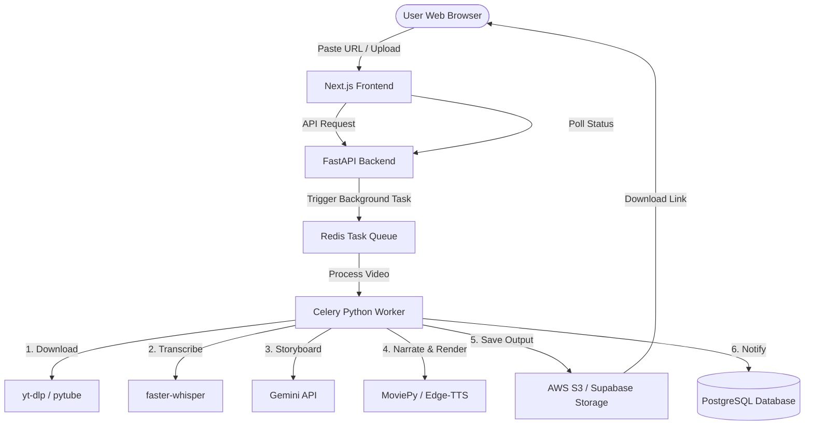

# Master SaaS Blueprint: AI Video Clipper & Summarizer Engine

This document contains the complete system blueprint, optimizations, architecture mapping, and codebase logic for the AI Clipping Software. Use this as context/memory to construct the web SaaS application in another directory.

---

## 📂 Codebase File Mapping

* **`main.py`**: The entry point. Handles mode selection (Viral Video Clipper vs. AI Movie Recapper), quality selector (720p vs. 1080p), YouTube bypass options, clip duration configurations, and metadata summary output.
* **`config.py`**: Manages environment variables, user agents, API keys, output directories, and contains the fix for the yt-dlp `YOUTUBE_COOKIES_CONTENT` import error.
* **`services/video_processor.py`**: The core execution engine. Orchestrates downloading, transcription, AI MOMENT selection, visual frame extraction, voiceover narration, audio splitting (ducking), face tracking/cropping, subtitle rendering, and final MP4 encoding.
* **`services/youtube_downloader.py`**: Primary video downloader. Leverages `pytubefix` for speed, automatically catching bot-detection locks and falling back to yt-dlp.
* **`services/youtube_downloader_yt_dlp.py`**: Secondary fallback downloader. Uses `yt-dlp` to download video streams and merges them using FFMPEG if high quality is requested.
* **`services/whisper_transcriber.py`**: Generates text transcripts and word-by-word timestamps using `faster-whisper`.
* **`services/gemini_selector.py`**: Interacts with the Gemini 2.5 Flash API to select viral clip highlights or generate narrative recap scripts based on dialogue transcripts and visual frames.
* **`services/face_tracker.py`**: Utilizes OpenCV and MediaPipe to detect faces and dynamically crop landscape videos to vertical formats (`9:16` or `9:8`).
* **`services/caption_maker.py`**: Sizers and renders custom-styled word-by-word subtitles onto video frames.
* **`styles/caption_styles.py`**: Contains styling tokens, outlines, colors, highlights, and viral keywords.

---

## ⚡ Core Engine Optimizations

### 1. 📝 70x Faster Caption Rendering
* **Old Way:** Rendering subtitles using standard MoviePy `TextClip` creates a separate video clip object for every word. For a 300-word clip, this creates 300 nested tracks, causing the compiler to crash or freeze.
* **Optimized Way:** A custom engine draws text onto small transparent bounding-box images using PIL (`ImageDraw.text`). These are overlaid directly onto the video frame numpy arrays in memory using OpenCV during the compilation loop:
  ```python
  def make_frame(gf, t):
      frame = gf(t)
      active_words = [w for w in pre_rendered_words if w['start'] <= t <= w['end']]
      if active_words:
          frame = frame.copy()
          for w_data in active_words:
              frame = overlay_image(frame, w_data['img'], w_data['x'], w_data['y'])
      return frame
  ```

### 2. 🧠 In-Memory Font Caching
* **Optimization:** Sizing captions requires calculating text boxes repeatedly. The engine uses a local dictionary (`self.font_cache`) to store parsed TrueType font instances (`ImageFont`). This avoids reloading `.ttf` files from the disk hundreds of times per run, eliminating Disk I/O bottlenecks.

### 3. 🛡️ CPU Whisper & Memory Fix
* **Optimization:** Runs `faster-whisper` on CPU using `int8` quantization. The worker count is locked to `num_workers=1` to prevent launching duplicate models in RAM (saving 500MB+ memory) and avoids scheduler core thrashes.

### 4. ⚡ 30 FPS Lock & Fast Downloads
* **30 FPS Lock:** The video writer in `video_processor.py` forces `fps=30`, halfing the rendering workload of standard 60 FPS streams.
* **Progressive Downloads:** Downloads progressive 720p streams instead of separate adaptive streams to bypass heavy local audio-video merge steps.

---

## 🍿 AI Movie Recapper Features

### 1. 👁️ Multimodal Visual Frame Analysis
* **Problem:** Text transcripts only contain dialog. If a scene is pure action, the AI recapper has to guess (hallucinate) what is happening.
* **Solution:** `video_processor.py` extracts **3 visual frames** (beginning, middle, end) from each clip segment using MoviePy's `get_frame(t)` and PIL. These are fed directly into the Gemini API alongside the text:
  ```python
  contents = []
  if visual_frames:
      contents.extend(visual_frames) # PIL Images
  contents.append(prompt)
  response = model.generate_content(contents)
  ```
  This forces the script to accurately describe actual visual events (monsters, colors, actions).

### 2. 🎙️ Natural Storytelling Voiceover (`edge-tts`)
* **Solution:** Uses `edge-tts` (Microsoft Edge Read Aloud) neural voices to generate expressive, human-like voiceovers instead of robotic gTTS text-to-speech. Includes a fail-safe fallback to standard gTTS in case of network timeouts.
* **Default Voice:** `en-US-ChristopherNeural` (deep, cinematic male storytelling voice).

### 3. 🎚️ Dynamic Audio Ducking & Volume Restore
* **Solution:** If a clip is longer than the narration, the engine splits the audio track. The movie's original volume is ducked to **10%** during the voiceover, and **automatically restores to 100% volume** for the rest of the clip.
  ```python
  audio_part1 = clip.audio.subclip(0, tts_audio.duration).volumex(0.1)
  combined_part1 = CompositeAudioClip([audio_part1, tts_audio])
  audio_part2 = clip.audio.subclip(tts_audio.duration, clip.duration) # 100% volume
  combined_audio = CompositeAudioClip([combined_part1.set_start(0), audio_part2.set_start(tts_audio.duration)])
  ```

---

## ⚡ YouTube Copyright Bypass Equation
* **Horizontal Mirroring:** Flips frames horizontally (`mirror_x(clip)`) to change visual hash signatures.
* **1.03x Speedup:** Speeds up audio/video by 3% (`speedx(clip, 1.03)`) to alter the audio spectrograph and video frame rate fingerprints.
* **Aligned Captions:** Scales Whisper word timestamps down by `1.03` to keep captions perfectly synced:
  ```python
  if words:
      for w_info in words:
          w_info['start'] /= 1.03
          w_info['end'] /= 1.03
  ```

---

## 🌐 SaaS System Web Architecture
To scale this local Python engine into a web SaaS (e.g. `Next.js` website), build using the following structure:



### Stack Components:
1. **Frontend:** Next.js (React) + Tailwind CSS (user uploads, visual timeline selector, export download).
2. **Backend API:** FastAPI (Python) or Express (Node.js). FastAPI is recommended since it interfaces directly with your Python clipping models.
3. **Task Queue:** Celery with Redis or RabbitMQ. (Video rendering takes minutes; you cannot block web requests. You must queue them).
4. **Object Storage:** AWS S3, Cloudflare R2, or Supabase Storage (stores inputs, backgrounds, and outputs).
5. **Database:** Supabase (PostgreSQL) + Prisma/SQLAlchemy (users, subscription status, processed video logs).
